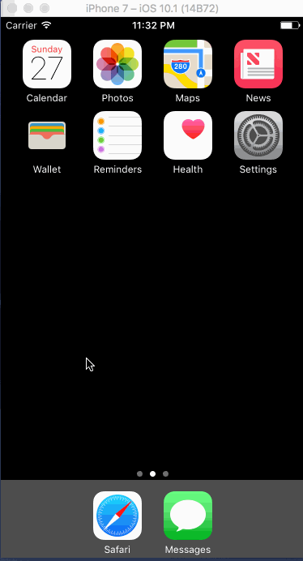

# Twitter

This is the Twitter Redux project.

Time spent: 14 hours spent in total

Completed user stories:

Hamburger menu
* [x] Dragging anywhere in the view should reveal the menu.
* [x] The menu should include links to your profile, the home timeline, and the mentions view.
* [x] The menu can look similar to the menu below or feel free to take liberty with the UI.
Profile page
* [x] Contains the user header view
* [x] Contains a section with the users basic stats: # tweets, # following, # followers
* [x] Shows the user timeline
Home Timeline
* [x] Tapping on a user image should bring up that user's profile page

Notes:

Optional features not completed as focus is on completing all required assignments to catch up.
The following issues were faced:
 
  Auto Layout
    - Ran into some issues of Auto Layout causing text in the profile view to be in weird places.
    
  Segues
    - Could not figure out how to get from tapping a profile picture on the tweets view controller to the profile view controller via segues, since XCode seems to only allow one segue per cell. I had to do it programatically.
    
  Twitter Refresh
    - It takes some time for Twitter retweets and likes to return via the API.
   
Walkthrough of all user stories:

We start already signed in to show the persisted timeline. We tap on a specific tweet to see its details. We tap on the profile picture to see that user's timeline and tap into a specific tweet. We pan right to reveal the menu and tap to our own profile and tap into a specific tweet. We return to the timeline and post a new tweet and see it reflected on the timeline. We view a We then post a new Tweet and it reflects in the timeline. Finally we logout/login.

GIF created with [LiceCap](http://www.cockos.com/licecap/).
